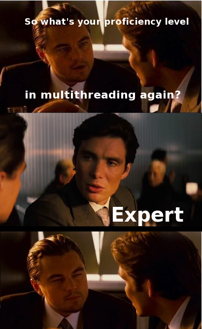

Actors- concurrent and distributed
==================================

:author: Vassil Dichev
:date: |date|

.. header::

  .. image:: images/java2days.png
    :class: scale
    :height: 73
    :width: 259

.. footer:: 2011 Java2Days Conference | 3-4 November, Sofia, Bulgaria | www.java2days.com

.. |date| date:: %d.%m.%Y

Why
---

.. class:: huge center

  It's time to raise the level of abstraction.

.. class:: incremental

* 1970s: GOTO considered harmful

* 1990s: manual memory management

* 2010-...: threads/locks

Shared-state
------------

.. sidebar:: \

  .. image:: images/DiningPhilosophers.gif
   :height: 324
   :width: 246
   :align: center
   :class: scale

* Staleness

* Corruption

* Liveness

* Performance

The interview
-------------

Puzzle
------

.. code-block:: java

  // jcip.net/listings/Holder.java
  public class Holder {
      private int n;
  
      public Holder(int n) {
          this.n = n;
      }
  
      public void assertSanity() {
          if (n != n)
              throw new AssertionError(
                  "This statement is false.");
      }
  }

Threads/locks
-------------

.. sidebar:: \

  .. image:: images/locks.jpg
   :class: scale
   :height: 352
   :width: 377
   :align: center

* Easy to get wrong

* Difficult to debug

* Break encapsulation

* Locks don't compose

* Threads don't scale

Best practices
--------------

.. sidebar:: \

  .. image:: images/jcip-cover.jpg
   :height: 373.5
   :width: 284.25
   :align: center
   :class: scale

* Thread confinement

* Immutability

* Safe publication

Actors
------

* Private state

* Immutable messages

* Asynchronous

Inversion of control
--------------------

Hollywood principle: Don't call me, I'll call you.

Actor implementation
--------------------

.. image:: images/concurrency_actor.png
 :class: scale
 :height: 230
 :width: 500
 :align: center

* Handler

* Internal message queue

Share-nothing advantages
------------------------

* Concurrency

* Distribution

* Fault-tolerance

History
-------

* Communicating Sequential Processes (C.A.R. Hoare)

* Actor model (Carl Hewitt)

* Erlang

* Dart

Erlang scales
-------------

* Ericsson phone switches

  * 99,9999999% uptime

* Facebook chat

  * 70 million concurrent users

* RabbitMQ

  * 400 000 messages/sec

* Apache CouchDB

  * distributed fault-tolerant DB

JVM actors
----------

* Java

  * `Kilim <http://www.malhar.net/sriram/kilim/>`_

  * `Jetlang <http://code.google.com/p/jetlang/>`_

* Scala

  * `Scala actors <http://www.scala-lang.org/node/242>`_

  * `Lift actors <http://liftweb.net>`_

  * `Akka <http://akka.io>`_

* Groovy 

  * `GPars <http://gpars.codehaus.org/>`_

Akka actors
-----------

* Toolkit for

  * concurrency

  * scalability

  * fault-tolerance

* lightweight (4 million actors on a JVM)

* Java and Scala APIs

* Integration with Spring

Define actors (Scala)
---------------------

.. code-block:: scala

  class MyActor extends Actor {
    def receive = {
      case "test" => println("received test")
      case _ => println("unknown message")
    }
  }
  

Define actors (Java)
--------------------

.. code-block:: java

  public class SampleUntypedActor
      extends UntypedActor {
  
      public void onReceive(Object message)
          throws Exception {
      if (message instanceof String)
          out.printf("Got String: %s", message));
      else
          throw new IllegalArgumentException(
              "Unknown message: " + message);
    }
  }

Create and call
---------------

* Scala

  .. code-block:: scala

    val actor = Actor.actorOf[MyActor]
    actor.start()
    // asynchronous- "fire-and-forget"
    actor ! "Hello"

* Java

  .. code-block:: java

    ActorRef actor = actorOf(
        SampleUntypedActor.class);
    actor.start();
    // asynchronous- "fire-and-forget"
    actor.tell("Hello");

Send-and-receive
----------------

* Scala

  .. code-block:: scala

    val future = actor ? "Hello"
    for (s <- future.as[String]) println(s)

* Java

  .. code-block:: java

    Future future = actor.ask("Hello");
    future.await();
    if (future.isCompleted()) {
        Option resultOption = future.result();
        if (resultOption.isDefined()) {
            Object result = resultOption.get();
            ...
        }
        ...
    }
    

Dispatchers
-----------

* Thread-based

* Event-based

* Priority event-based

* Work-stealing (Fork/join framework)

Remote actors
-------------

.. code-block:: scala

  remote().start()
  remote().register("user-service", actor)
  ...
  val actor = remote.actorFor("user-service",
    "localhost", 2552)

Cloudy Akka
-----------

* Clustered actors

* Automatic replication

* Automatic deployment

* Automatic failover

Failover
--------

.. class:: huge center

.. 

  If you can't detect a failure, you can't fix it
  
  -- Joe Armstrong

Error handling in Java
----------------------

.. code-block:: java

  try {
      try {
      } finally {
      }
      try {
          try {
          } finally {
          }
      } finally {
      }
  } finally {
      try {
      } finally {
      }
  }

Let it crash
------------

.. sidebar:: \

  .. image:: images/sup4.gif
   :height: 186
   :width: 376
   :align: center
   :class: scale

* link to supervisors

  .. code-block:: scala

    supervisor.link(actor)

* configure

  * strategy

    * one-for-one

    * all-for-one

  * restart

    * timeout

    * number of failures

  * behaviour

    * pre stop

    * post restart

No silver bullet
----------------

.. sidebar:: \

  .. image:: images/silver-bullet.jpg
   :class: scale
   :height: 282
   :width: 338.25
   :align: center

.. class:: incremental

.. 

  Will actors solve all my concurrency / distribution / failover problems?

.. class:: incremental huge center

.. 

  Maybe

.. class:: incremental center

.. 

  Maybe not

Just a tool
-----------

.. sidebar:: \

  .. image:: images/agent_smith.jpg
   :class: scale
   :height: 300
   :width: 400
   :align: center

* Agents

* Futures

* Software Transactional Memory

* Dataflow concurrency

postStop
--------

.. class:: incremental

* audience ? "Questions"

* audience ! "Thank You"

* self.stop()