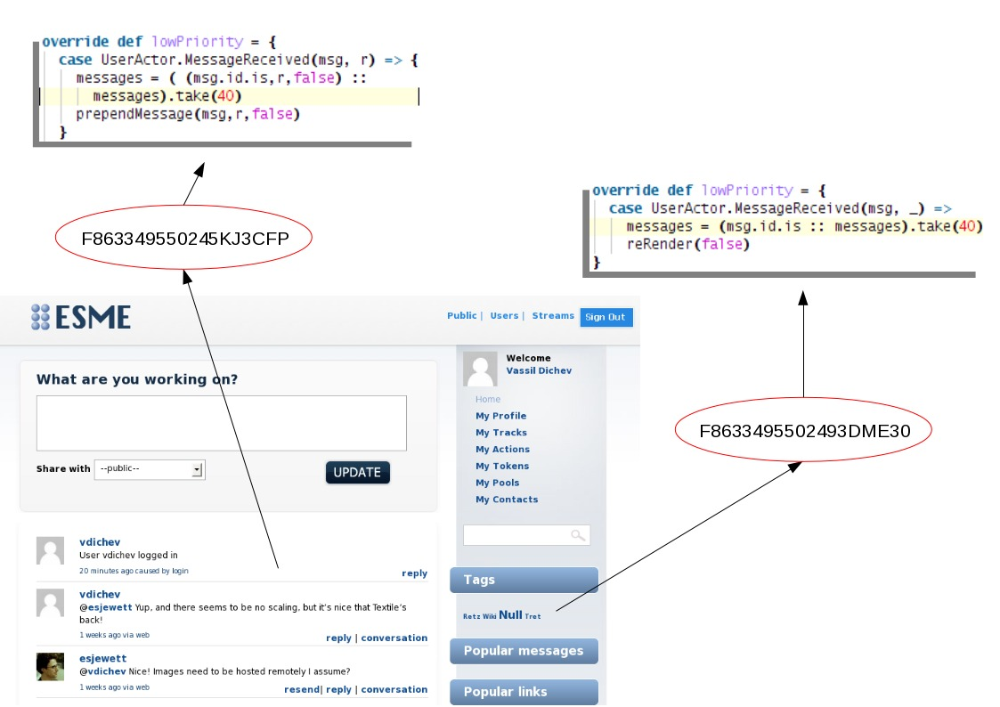
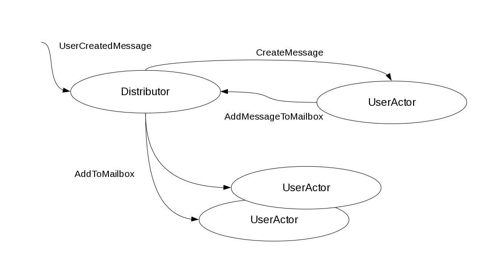

Apache ESME- Lift and social apps
=================================

:author: Vassil Dichev
:date: |date|

.. |date| date:: %d.%m.%Y

.. role:: del

.. raw:: pdf

  SetPageCounter 0

Stairway to Scala
-----------------

.. class:: incremental

* J2EE refugee

  .. started with EJB 1.x

* Spring- "J2EE light"

* Fun with Python/Ruby

  .. comprehensions/map FTW!

* Discovered Scala and Lift

* Time-strapped dad

No time for boilerplate
-----------------------

.. class:: right

.. 

  These days I'd say that my love for expressive programming languages is mostly driven by a near-complete lack of free time.

.. sidebar:: @fogus

  .. image:: images/fogus.jpg
    :class: scale
    :width: 128
    :height: 128
    :align: left
  
  Michael Fogus

Esme who?
---------

.. class:: incremental

* Enterprise Social Messaging :del:`Experiment`/Environment

* Biggest open-source Lift application

* First Apache project using Scala exclusively

ESME history
------------

.. class:: incremental

* **2007** David Pollak creates Skittr (884 lines)

* **2008** SAP community joins to start ESME

* **2009** ESME moves to Apache Incubator

* **2010** ESME graduates to a top-level Apache project

* **2011** ~8000 lines of Scala

Yet Another App
---------------

.. class:: right

.. 

  ANOTHER :del:`mobile` social :del:`group` chat :del:`photo sharing` app! Exactly what I need!

.. sidebar:: @jorgeortiz85

  .. image:: images/jorgeortiz85.jpg
    :class: scale
    :width: 128
    :height: 128
    :align: left
  
  Jorge Ortiz

Beyound Lift chat demo
----------------------

.. class:: incremental

* Real-time updates

* Pools

* Retweets

* Built-in URL shortener

* Popularity stats

* API (RESTful and Twitter-compatible)

* Actions

  .. Actions

    * Google Wave

    * OAuth

    * bots

Action examples
---------------

.. class:: borderless

============  =======
filter        perform
============  =======
"bieber"      filter
#Scala        resend
to = @me      mailto:my@address.org
every 5 mins  rss:http://blog.esme.us/rss
pool:repl     scala
============  =======

Lift pitch
----------

.. class:: incremental

* Real-time

* Secure

* Scalable

* Concise

* Modules

* `...and more: http://SevenThings.liftweb.net <http://seventhings.liftweb.net/>`_

Is Lift difficult?
------------------

.. class:: huge

.. 

  Lift: think outside the Box.

.. sidebar:: @djspiewak

  .. image:: images/djspiewak.jpg
    :class: scale
    :width: 128
    :height: 128
    :align: left
  
  Daniel Spiewak

View first
----------

Comet
-----

.. code-block:: html

  <lift:comet type="TagCloud"/>

.. code-block:: scala

  class TagCloud extends CometActor
    def render = {
      val messages = lookupMessages()
      

          {
            ...
          }
      

    }
    override def lowPriority = {
      case UserActor.MessageReceived(msg, _) =>
        messages = (msg.id.is :: messages).take(40)
        reRender(false)
    }

Mapper
------

.. code-block:: scala

  val mb = findAll(By(user, userId),
                   OrderBy(id, Descending),
                   MaxRows(count))

Actors
------

Embrace immutability
--------------------

.. class:: incremental

* easy for concurrency

* easy to cache

* easy to distribute

Testing
-------

.. code-block:: scala

  "no follower's message in home timeline" in {
    post("/statuses/update.xml",
           followerClient,
           Nil,
           "status" -> "follower_msg")
      \\(<text>follower_msg</text>)
  
    get("/statuses/home_timeline.xml")
      !\\(<text>follower_msg</text>)
  }

Lift modules
------------

.. class:: incremental

* Authentication

  * OpenID

  * LDAP

  * Container-based

* Textile

* XMPP

LDAP
----

.. code-block:: scala

  object myLdapVendor extends LDAPVendor
  
  myLdapVendor.configure(Map("ldap.url" ->
      "ldap://%s:%s".format(ldapSrvHost,
                            ldapSrvPort),
    "ldap.base" -> ldapSrvBase,
    "ldap.userName" -> ldapSrvUsrName,
    "ldap.password" -> ldapSrvPwd,
    "ldap.authType" -> ldapSrvAuthType,
    "referral" -> ldapSrvReferral,
    "ldap.initial_context_factory" ->
      ldapSrvCtxFactory))
  
  if(myLdap.bindUser(constructNameWithPrefix(name), pwd) &&
    checkRoles(constructDistinguishedName(name))) {

Textile
-------

.. code-block:: scala

  MsgParser.parseMessage(in) map { lst =>
  
    val xml = <message><body>{
      lst map {
        // get rid of extra paragraphs
        case textile: Textile =>
          paraFixer(textile.toHtml)
      }
    }</body>
  

Lift resources
--------------

.. class:: borderless

.. list-table::

  * 

    * Simply Lift

    * `http://simply.liftweb.net <http://simply.liftweb.net/>`_

  * 

    * Exploring Lift

    * `http://exploring.liftweb.net <http://exploring.liftweb.net/>`_

  * 

    * Lift in Action

    * 

      .. image:: images/lift-in-action-cover.jpg
        :class: scale
        :width: 160
        :height: 200
        :align: left

Inventing yourself
------------------

.. class:: huge

.. 

  OH: "We *invented* NIH."

.. sidebar:: @ebowman

  .. image:: images/ebowman.jpg
    :class: scale
    :width: 128
    :height: 128
    :align: left
  
  Eric Bowman

RSS
---

.. code-block:: scala

  override def getText(node: Node) = {
    // if there's no title, get description
    val title = node \ "title"
    if (title isEmpty)
      node \ "description" text
    else
      title text
  }
  override def getLink(node: Node) = {
    // a link is optional
    val link = node \ "link"
    if (link isEmpty)
      ""
    else
      link text
  }

Express yourself
----------------

.. code-block:: scala

  // extractor for last element of a List
  object ::> {def unapply[A] (l: List[A]) =
    l match {
      case Nil => None
      case _ => Some( (l.init, l.last) )
    }
  }
  
  case Req(ApiPath ::>
          "statuses" ::>
          "user_timeline",
    this.method, GetRequest) => userTimeline
  

The End
-------

.. class:: incremental

* Questions?

* `Learn or contribute: esme.apache.org <http://esme.apache.org/>`_

* Thank You!