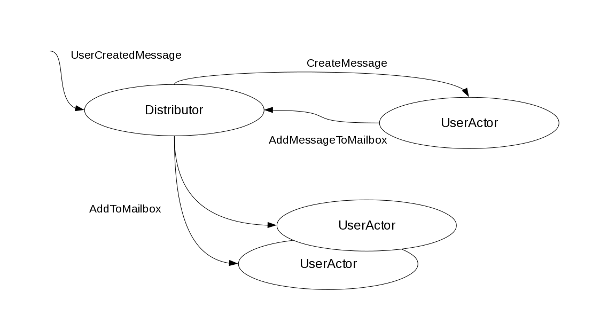

Apache ESME- Using Scala and Lift for social messaging
======================================================

:author: Vassil Dichev
:date: |date|

.. |date| date:: %d.%m.%Y

.. role:: del

Esme who?
---------

.. class:: incremental

* Enterprise Social Messaging :del:`Experiment` Environment

* Biggest open-source Lift application

* Only Apache project using Scala exclusively

ESME history
------------

.. class:: incremental

* **2007** David Pollak creates Skittr (884 lines)

* **2008** Three DemoJams (SAP)

* **2009** ESME moves to Apache Incubator

* **2010** ESME graduates to a top-level Apache project

Yet Another App
---------------

.. sidebar:: @jorgeortiz85

  .. image:: images/jorgeortiz85.jpg
    :class: scale
    :width: 128
    :height: 128
    :align: left
  
  Jorge Ortiz

.. class:: right

.. 

  ANOTHER :del:`mobile` social :del:`group` chat :del:`photo sharing` app! Exactly what I need!

Beyound Lift chat demo
----------------------

.. class:: incremental

* Real-time updates (years before Yammer)

* Pools (like Yammer groups)

* Retweets (months before Twitter)

* Built-in URL shortener

* Popularity stats (status.net)

* API (RESTful and Twitter-compatible)

* Actions (assemble bots/apps)

  .. Actions

    * Google Wave

    * OAuth

    * bots

.. Zawinski's Law was: "Every program attempts to expand until it can read email" and should now be "Every program expands until it can Tweet"

Action examples
---------------

.. class:: borderless

============  =======
filter        perform
============  =======
"bieber"      filter
#Scala        resend
to = @me      mailto:my@address.org
every 5 mins  rss:http://blog.esme.us/rss
pool:repl     scala
============  =======

Lift pitch
----------

.. class:: incremental

* Real-time updates with Comet

* Security

* Lightweight actors

* Modules

* `...and more: http://SevenThings.liftweb.net <http://seventhings.liftweb.net/>`_

Lift
----

.. sidebar:: @djspiewak

  .. image:: images/djspiewak.jpg
    :class: scale
    :width: 128
    :height: 128
    :align: left
  
  Daniel Spiewak

.. class:: huge

.. 

  Lift: think outside the Box.

View first
----------

.. image:: images/esme-comet.png
  :class: scale
  :width: 900
  :height: 636
  :align: left

Comet
-----

.. code-block:: html

  <lift:comet type="TagCloud"/>

.. code-block:: scala

  class TagCloud extends CometActor
    def render = {
      val messages = lookupMessages()
      

          {
            ...
          }
      

    }
  
    override def lowPriority = {
      case UserActor.MessageReceived(msg, _) =>
        messages = (msg.id.is :: messages).take(40)
        reRender(false)
    }
  }

Mapper
------

.. code-block:: scala

  val mb = findAll(By(user, userId),
                   OrderBy(id, Descending),
                   MaxRows(count))

Embrace immutability
--------------------

.. class:: incremental

* easy for concurrency

* easy to cache

* easy to distribute

Actors
------

Testing
-------

.. code-block:: scala

  "no follower's message in home timeline" in {
    post("/statuses/update.xml",
           followerClient,
           Nil,
           "status" -> "follower_msg")
      \\(<text>follower_msg</text>)
  
    get("/statuses/home_timeline.xml")
      !\\(<text>follower_msg</text>)
  }

Configure Ostrich
-----------------

.. code-block:: scala

  if (Props.getBool("jmx.enable", false))
    StatsMBean("org.apache.esme.stats")
  val runtime = new RuntimeEnvironment(getClass)
  val config = new Config
  config("admin_text_port") =
    Props.getInt("admin_text_port", 9989)
  config("admin_http_port") =
    Props.getInt("admin_http_port", 9990)
  ServiceTracker.startAdmin(config, runtime)

Monitor sessions
----------------

.. code-block:: scala

  SessionMaster.sessionWatchers +:= SessionInfoDumper
  
  Stats.makeGauge("liftSessions") {
    SessionInfoDumper.count.toDouble
  }
  
  object SessionInfoDumper extends LiftActor {
    private var sessionSize = 0
    def count = sessionSize
    protected def messageHandler = {
      case SessionWatcherInfo(sessions) =>
        sessionSize = sessions.size
  

Using Ostrich
-------------

.. code-block:: scala

  Stats incr "messagesDelivered"

Lift modules
------------

.. class:: incremental

* Authentication

  * OpenID

  * LDAP

  * Container-based

* Textile

* XMPP

LDAP
----

.. code-block:: scala

  object myLdapVendor extends LDAPVendor
  
  myLdapVendor.configure(Map("ldap.url" ->
      "ldap://%s:%s".format(ldapSrvHost,
                            ldapSrvPort),
    "ldap.base" -> ldapSrvBase,
    "ldap.userName" -> ldapSrvUsrName,
    "ldap.password" -> ldapSrvPwd,
    "ldap.authType" -> ldapSrvAuthType,
    "referral" -> ldapSrvReferral,
    "ldap.initial_context_factory" ->
      ldapSrvCtxFactory))
  
  if(myLdap.bindUser(constructNameWithPrefix(name), pwd) &&
    checkRoles(constructDistinguishedName(name))) {

Textile
-------

.. code-block:: scala

  MsgParser.parseMessage(in) map { lst =>
  
    val xml = <message><body>{
      lst map {
        // get rid of extra paragraphs
        case textile: Textile =>
          paraFixer(textile.toHtml)
      }
    }</body>
  

Lift resources
--------------

.. class:: borderless

.. list-table::

  * 

    * Simply Lift

    * `http://simply.liftweb.net <http://simply.liftweb.net/>`_

  * 

    * Exploring Lift

    * `http://exploring.liftweb.net <http://exploring.liftweb.net/>`_

  * 

    * Lift in Action

    * 

      .. image:: images/lift-in-action-cover.jpg
        :class: scale
        :width: 160
        :height: 200
        :align: left

Scala
-----

.. sidebar:: @al3x

  .. image:: images/al3x.png
    :class: scale
    :width: 72
    :height: 72
    :align: left
  
  Alex Payne

.. class:: right

.. 

  … What fires me up about Scala is its pragmatism: good OOP, good FP, good type system. Very little dogma. A get-shit-done language.

Advanced Scala
--------------

.. class:: incremental

* expressive

* extensible

* immutable structures

* actors

* XML support

* easy parsing

Express yourself
----------------

.. code-block:: scala

  // extractor for last element of a List
  object ::> {def unapply[A] (l: List[A]) =
    l match {
      case Nil => None
      case _ => Some( (l.init, l.last) )
    }
  }
  
  case Req(ApiPath ::>
          "statuses" ::>
          "user_timeline",
    this.method, GetRequest) => userTimeline
  

Functional meets OOP
--------------------

.. code-block:: scala

  override lazy val lineElem: Parser[Textile] = {
    not(blankLine) ~>
      (endOfLine | image | footnote_def |
       anchor | dimension | elipsis  |
       copyright | trademark | registered |
       emDash |
       enDash | italic | emph | bold  |
       cite |  span | code | delete | insert |
       sup | sub | strong | html |
       single_quote | quote | acronym | 
       atName | hashTag | charBlock)
  }
  

trapExit
--------

.. class:: incremental

* audience !? Questions

* audience ! ThankYou