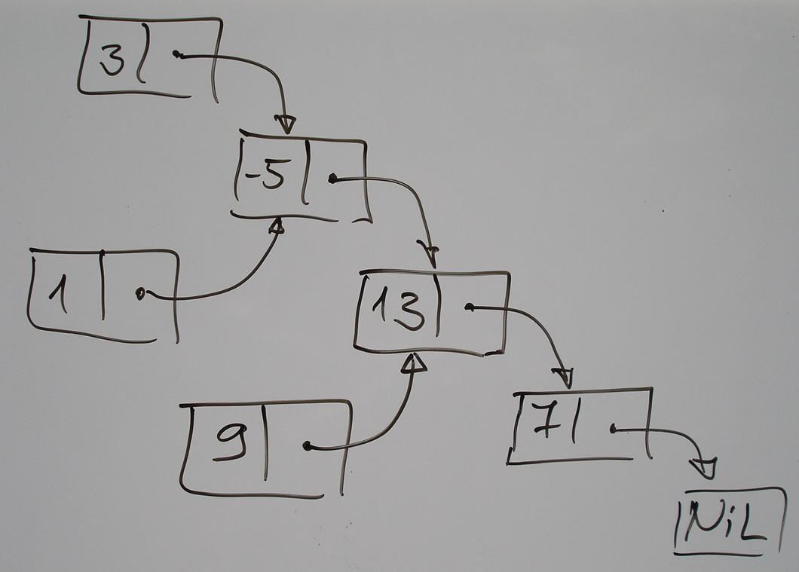

Lessons of Functional programming
=================================

:author: Vassil Dichev
:date: |date|

.. header::

  .. image:: images/java2days.png
    :class: scale
    :height: 73
    :width: 259

.. footer:: 2012 Java2Days Conference | 25-26 October, Sofia, Bulgaria | www.java2days.com

.. |date| date:: %d.%m.%Y

.. include:: <s5defs.txt>

.. Who am I?

.. Spring, J2EE, XML

.. Not an academic

Why learn?
----------

.. class:: huge center

  :incremental:`Development is moving towards functional programming`
  
  `...or is, at least, increasingly influenced by it.`:incremental:

Great paradigm shifts
---------------------

.. class:: incremental

* GOTO → structured programming

* Manual memory management → Garbage collection

* Imperative programming → Functional programming

Benefits
--------

.. class:: incremental

* Correctness

* Compositionality

* Flexible execution (parallelization)

Function definition
-------------------

.. sidebar:: \ 

  .. image:: images/function.png
    :class: scale
    :width: 375
    :height: 375
    :align: center

* Math: mapping inputs to outputs

* Programming: decompose and reuse solutions

Functional Programming
----------------------

.. class:: incremental

* Referential transparency

* Functions as first-class

Finding FP
----------

.. class:: incremental

* Excel

* XSLT

* REST

  * stateless

  * idempotent

* Hadoop, Google MapReduce...

Referential transparency
------------------------

.. class:: incremental

* Debugging

  * Reproducible

  * State

* Testing

  * Reproducible

  * State

Benefits
--------

* Correctness

* Compositionality

* Flexible execution (parallelization)

Immutability
------------

.. class:: incremental

* String

* Joda time

* Effective Java

  .. 

    Classes should be immutable unless there's a very good reason to make them mutable
    
    --Joshua Bloch

Java Concurrency
----------------

.. sidebar:: \

  .. image:: images/jcip-cover.jpg
    :height: 373.5
    :width: 284.25
    :align: center
    :class: scale

.. 

  Immutable objects are simple.

.. 

  Immutable objects are also safer.

.. 

  Immutable objects are always thread-safe.

Immutability
------------

.. class:: incremental

* thread-safe

* don't need copy and clone

* easily cached

* good Set and HashMap keys

Benefits
--------

* Correctness

* Compositionality

* Flexible execution (parallelization)

Life without mutation
---------------------

.. class:: incremental

* Recursion

* Functional data structures

* Local mutation

  * If a tree falls in the forest and nobody hears it, does it make a sound?

Recursion and the stack
-----------------------

.. image:: images/stack.jpg
  :class: scale
  :align: center
  :height: 526
  :width: 687

Functional data structures
--------------------------

Lambda Expressions
------------------

Anonymous classes

.. class:: incremental

* declaration

* this and super

* return

Functional interfaces
---------------------

.. code-block:: java

  void Runnable.run()
  T Callable<V>.call()
  int Comparator<T>.compare(T o1, T o2)
  boolean FileFilter.accept(File path)
  void ActionListener.actionPerformed(ActionEvent e)
  void ChangeListener.stateChanged(ChangeEvent e)

Variable capture
----------------

Must be effectively final

.. code-block:: java

  int sum = 0;
  list.forEach(e -> { sum += e.size(); });

Race conditions
---------------

.. 

  To evolve the language in 2011 in a way that makes concurrent and parallel operations even more dangerous would be foolish.
  
  --Brian Goetz

Higher-order functions
----------------------

Functions, which take other functions as parameters and/or return functions.

.. class:: borderless

.. list-table::

  * 

    * 

      * map (collect)

    * 

      .. image:: images/map_op.jpg
        :class: scale
        :align: center
        :width: 200
        :height: 107

  * 

    * 

      * filter (select, find_all, findAll)

    * 

      .. image:: images/filter_op.jpg
        :class: scale
        :align: center
        :width: 200
        :height: 107

  * 

    * 

      * fold (reduce, inject)

    * 

      .. image:: images/fold_op.jpg
        :class: scale
        :align: center
        :width: 200
        :height: 62

Combinators are reusable!
-------------------------

.. class:: borderless

.. list-table::

  * 

    * 

      .. 

        Combinators are arguably the most reusable constructs we have in programming
        
        --Dean Wampler

    * 

      .. image:: images/fp4jd.jpg
        :height: 400
        :width: 305
        :align: center
        :class: scale

New idioms
----------

.. code-block:: java

  list.map(e -> e.size())
      .reduce(0, (a, b) -> a+b);

Expressions everywhere
----------------------

.. class:: incremental

* transformations

* REPL (Read-Eval-Print Loop)- interactive shell

* Declarative- DSLs

Patterns
--------

.. class:: incremental

* Command

* Strategy

* Builder

* Factory

.. History

.. Turing machines

.. Lambda calculus

.. SKI calculus

JVM languages
-------------

* Scala

.. code-block:: scala

  list.map(2 * _)
  list.filter(_ % 2 == 0)

* Clojure

.. code-block:: clojure

  (map #(* 2 %) '(1 2 3))
  (filter #(= (mod % 2) 0) '(1 2 3))

Java libraries
--------------

.. class:: incremental

* Guava

  .. java.dzone.com > Articles > Filtering-and-transforming

* lambdaj

  * select

  * convert

* FunctionalJava

Summary
-------

.. class:: incremental

* Two definitions of Functional programming

  * First-class functions

  * Referential transparency

* Both have benefits

* Go gently; no need to go FP all the way

* Don't panic- you know this stuff!

.. Functional elements

.. recursion & tailcall optimization

.. list comprehensions

.. pattern matching

.. lazy evaluation

.. curried functions

.. REPL

The End
-------

.. class:: incremental

* Questions?

* Thank You!

.. References

.. ibm.com > Developerworks > Java > Library > J-fp > Index

.. blog.jthoenes.net > 2012 > 08 > 03 > Java-8-testing-the-lambda-water

.. doanduyhai.wordpress.com > 2012 > 07 > 12 > Java-8-lambda-in-details-part-ii-scoping-of-this-and-effectively-final-variable-semantic

.. javabeat.net > 2012 > 05 > A-sneak-peak-at-the-lambda-expressions-in-java-8

.. geeksaresexy.net > 2009 > 02 > 06 > An-introduction-to-functional-programming

.. micheles.googlecode.com > Hg > Pypers > Pycon10 > Talk

.. ibm.com > Developerworks > Java > Library > J-ldn2

.. cr.openjdk.java.net > Briangoetz > Lambda > Lambda-state-4

.. infoq.com > Presentations > Value-Values

.. shaffner.us > Cs > Papers > Tarpit

.. ibm.com > Developerworks > Java > Library > J-jtp02183 > Index