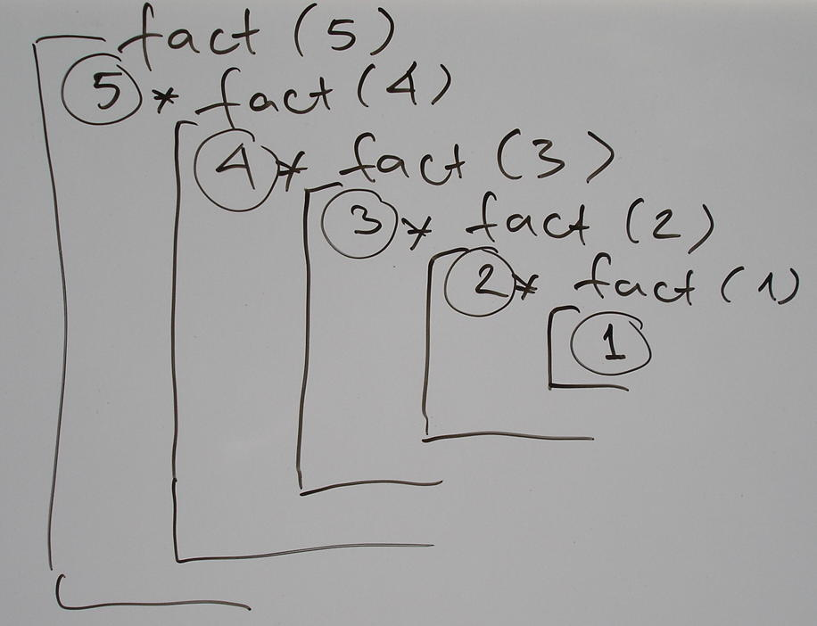
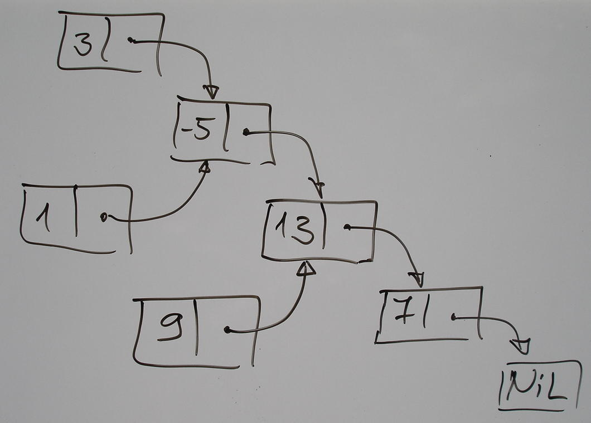

Lessons of Functional programming
=================================

:author: Vassil Dichev
:date: |date|

.. footer:: Questers

.. 

  .. header::

    .. image:: images/questers.png
        :class: scale
        :height: 93
        :width: 192

.. |date| date:: %d.%m.%Y

.. include:: <s5defs.txt>

Who am I?
---------

* Java, J2EE, Spring, XML, bla bla bla

* Scala

* Not an academic

Why learn?
----------

.. class:: huge center

  :incremental:`Development is moving towards functional programming`
  
  `...or is, at least, increasingly influenced by it.`:incremental:

Great paradigm shifts
---------------------

.. class:: incremental

* GOTO → structured programming

* Manual memory management → Garbage collection

* Imperative programming → Functional programming

Benefits
--------

.. class:: incremental

* Correctness

* Compositionality

* Flexible execution (parallelization)

Structured programming
----------------------

* Subroutines, procedures, functions

* Correct

  * cannot send execution to arbitrary place

* Composable

  * can call functions from different locations

Garbage collection
------------------

* Correct

  * no pointer arithmetic

  * memory leaks

* Composable

  * responsibility to clean up

  * race conditions

* Flexible execution

  * enables concurrent/parallel code

Function definition
-------------------

.. sidebar:: \ 

  .. image:: images/function.png
      :class: scale
      :height: 375
      :width: 375
      :align: center

* Math: mapping inputs to outputs

* Programming: decompose and reuse solutions

Definitions of FP
-----------------

.. class:: incremental

* Referential transparency

  * Functions return same values

  * Controlled side effects

* Functions as first-class

Finding FP
----------

.. class:: incremental

* Excel

* XSLT

* REST

  * stateless

  * idempotent

* Hadoop, Google MapReduce...

* SQL SELECT statements

Side effects- first lesson
--------------------------

.. code-block:: pascal

  PROCEDURE ToFahrenheit(x: REAL);
  BEGIN
    WriteLn(9/5 * x + 32);
  END
  
  FUNCTION ToFahrenheit(x: REAL): REAL;
  BEGIN
    ToFahrenheit := 9/5 * x + 32;
  END

Side effects- first lesson
--------------------------

.. code-block:: java

  public static void fahrenheit(double c) {
      out.println(1.8 * c + 32);
  }
  public static double fahrenheit(double c) {
      return 1.8 * c + 32;
  }

Referential transparency
------------------------

.. class:: incremental

* Debugging

  * Reproducible

  * State

* Testing

  * Reproducible- need just inputs

  * State- no huge setUp methods

Benefits
--------

* Correctness

  * easier to test

* Compositionality

  * no dependency on setup code

* Flexible execution (parallelization)

Immutability
------------

.. class:: incremental

* Java String

* Joda time

* Best practices are FP

  .. 

    Classes should be immutable unless there's a very good reason to make them mutable
    
    --Joshua Bloch (Effective Java)

Java Concurrency
----------------

.. sidebar:: \

  .. image:: images/jcip-cover.jpg
      :height: 373.5
      :width: 192
      :align: center
      :class: scale

.. 

  Immutable objects are simple.
  
  Immutable objects are also safer.
  
  Immutable objects are always thread-safe.

Immutability
------------

.. class:: incremental

* thread-safe

* don't need copy and clone

* easily cached

* good Set and HashMap keys

Benefits
--------

* Correctness

  * functions can't change your data

* Compositionality

* Flexible execution (parallelization)

HDYWTDT?
--------

* Haskell

.. code-block:: haskell

  i = 1
  i = 2
  
  Multiple declarations of `i'

* Erlang

.. code-block:: erlang

  i = 1
  i = 2
  
  exception error: no match of right
    hand side value 2

Life without mutation
---------------------

.. class:: incremental

* Recursion

* Functional data structures

* Local mutation

  * If a tree falls in the forest and nobody hears it, does it make a sound?

Iterative factorial
-------------------

.. code-block:: java

  public static long factorial(int num) {
      long result = 1;
      for(int i = 2; i <= num; i++) {
          result *= i;
      }
      return result;
  }

Recursive factorial
-------------------

.. code-block:: java

  public static long factorial(int num) {
      if (num == 0) {
          return 1;
      } else {
          return num * factorial(num - 1);
      }
  }

Recursion and the stack
-----------------------

Functional data structures
--------------------------

Git graph
---------

Variable capture
----------------

Must be effectively final

.. code-block:: java

  int sum = 0;
  list.forEach(e -> { sum += e.size(); });

Race conditions
---------------

.. 

  To evolve the language in 2011 in a way that makes concurrent and parallel operations even more dangerous would be foolish.
  
  --Brian Goetz

Higher-order functions
----------------------

Functions, which take other functions as parameters and/or return functions.

.. class:: borderless

.. list-table::

  * 

    * 

      * map (collect)

    * 

      .. image:: images/map_op.jpg
          :class: scale
          :align: center
          :width: 200
          :height: 107

  * 

    * 

      * filter (select, find_all, findAll)

    * 

      .. image:: images/filter_op.jpg
          :class: scale
          :align: center
          :width: 200
          :height: 107

  * 

    * 

      * fold (reduce, inject)

    * 

      .. image:: images/fold_op.jpg
          :class: scale
          :align: center
          :width: 200
          :height: 107

Combinators are reusable!
-------------------------

Higher-order functions are also called combinators

.. class:: borderless

.. list-table::

  * 

    * 

      .. 

        Combinators are arguably the most reusable constructs we have in programming
        
        --Dean Wampler

    * 

      .. image:: images/fp4jd.jpg
          :class: scale
          :align: center
          :width: 305
          :height: 400

New idioms
----------

.. code-block:: java

  list.map(e -> e.size())
      .reduce(0, (a, b) -> a+b);

SQL and higher-order functions
------------------------------

* SELECT → map

* WHERE → filter

* JOIN → flatMap

* SQL

.. code-block:: sql

  SELECT age, name from PEOPLE where age > 18

* Slick

.. code-block:: scala

  people.filter(_.age > 18).
         map(p => (p.age, p.name))

Expressions everywhere
----------------------

.. class:: incremental

* transformations

* REPL (Read-Eval-Print Loop)- interactive shell

* Declarative- DSLs

Patterns are FP
---------------

.. class:: incremental

* Command

* Strategy

* Builder

* Factory

.. History

.. Turing machines

.. Lambda calculus

.. SKI calculus

Languages
---------

* Haskell

.. code-block:: haskell

  map (2 *) [1, 2, 3]
  filter even [1, 2, 3]

* Erlang

.. code-block:: erlang

  map(fun(X) -> 2 * X end, [1,2,3]).
  filter(fun(X) -> X rem 2 == 0 end, [1,2,3]).

JVM languages
-------------

* Scala

.. code-block:: scala

  list.map(2 * _)
  list.filter(_ % 2 == 0)

* Clojure

.. code-block:: clojure

  (map #(* 2 %) '(1 2 3))
  (filter #(= (mod % 2) 0) '(1 2 3))

Java libraries
--------------

.. class:: incremental

* Guava

  .. java.dzone.com > Articles > Filtering-and-transforming

* lambdaj

  * select

  * convert

* FunctionalJava

Summary
-------

.. class:: incremental

* Two definitions of Functional programming

  * First-class functions

  * Referential transparency

* Both have benefits

* Go gently; no need to go FP all the way

* Don't panic- you know this stuff!

.. Functional elements

.. recursion & tailcall optimization

.. list comprehensions

.. pattern matching

.. lazy evaluation

.. curried functions

.. REPL

The End
-------

.. class:: incremental

* Questions?

* Thank You!

.. References

.. ibm.com > Developerworks > Java > Library > J-fp > Index

.. blog.jthoenes.net > 2012 > 08 > 03 > Java-8-testing-the-lambda-water

.. doanduyhai.wordpress.com > 2012 > 07 > 12 > Java-8-lambda-in-details-part-ii-scoping-of-this-and-effectively-final-variable-semantic

.. javabeat.net > 2012 > 05 > A-sneak-peak-at-the-lambda-expressions-in-java-8

.. geeksaresexy.net > 2009 > 02 > 06 > An-introduction-to-functional-programming

.. micheles.googlecode.com > Hg > Pypers > Pycon10 > Talk

.. ibm.com > Developerworks > Java > Library > J-ldn2

.. cr.openjdk.java.net > Briangoetz > Lambda > Lambda-state-4

.. infoq.com > Presentations > Value-Values

.. shaffner.us > Cs > Papers > Tarpit

.. ibm.com > Developerworks > Java > Library > J-jtp02183 > Index