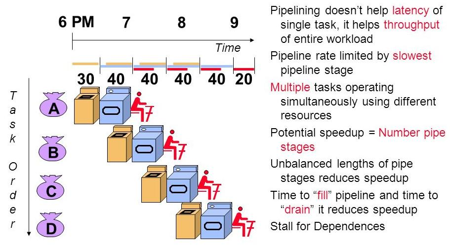
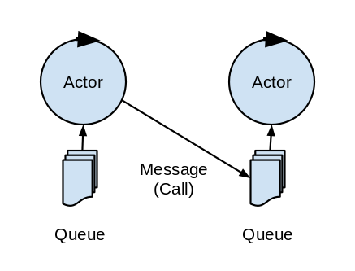
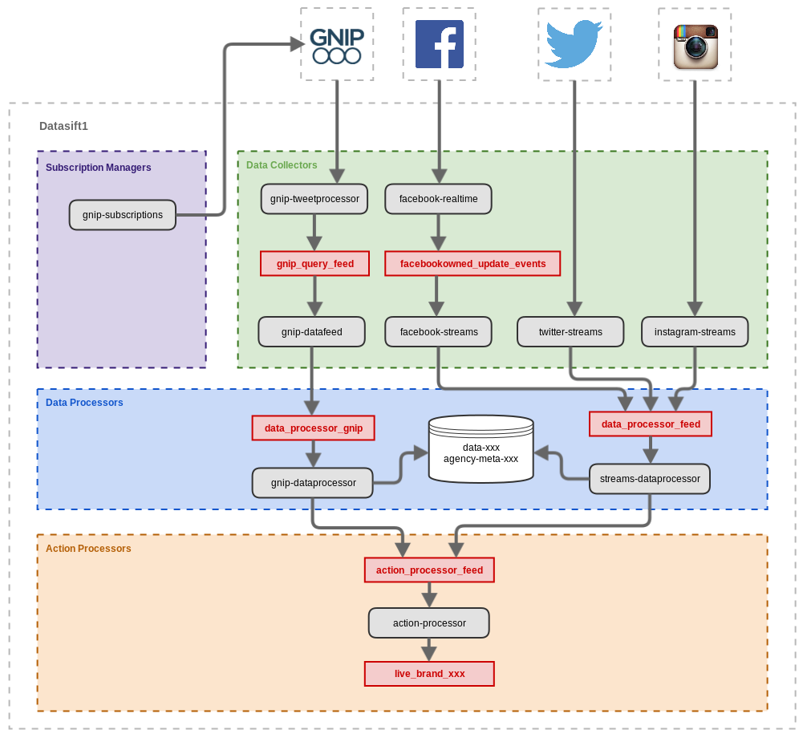

Applying the pipeline pattern
=============================

:author: Vassil Dichev
:date: |date|

.. footer:: Questers

.. 

  .. header::

    .. image:: images/questers.png
        :class: scale
        :height: 93
        :width: 192

.. |date| date:: %d.%m.%Y

Patterns
--------
      pattern (noun): a reliable sample of traits, acts, tendencies, or other observable characteristics
    

* Instruction pipelines

* Unix pipes

* Collection pipeline (Martin Fowler)

* Pipes and filters (Enterprise Integration Patterns)

UNIX
----

.. sidebar:: \

  .. image:: images/pipe.png
      :class: scale
      :width: 306
      :height: 395

.. 

  We should have some ways of coupling programs like garden hose--screw in another segment when it becomes when it becomes necessary to massage data in another way.
  
  M.D.McIlroy
  
  October 11, 1964

Pipelines
---------

.. sidebar:: \

  .. image:: images/pipepanic.png
      :class: scale
      :width: 350
      :height: 350

* Processing items of the same type

* Small tools/services

* Fixed sequence of operations

* Well established communication interfaces

* Buffers

.. Variations

.. Pipeline hardware architectures

.. Collection pipeline pattern (Martin Fowler)

.. Pipes and filters integration pattern

.. Directed Acyclic Graph

Advantages
----------

.. Pic needed

* No cyclic dependencies

* Parallelism

* Laziness

* Immutability

* Debugging

Characteristics
---------------

.. Pic needed

.. Latency

.. Throughput

.. Slowest element

UNIX pipe
---------

* Processing item: lines

* Small tools

* Communication interface: text

* Buffer

* Lazy and parallel

* Immutable

Functional programming
----------------------
      "90% of functional programming is list processing"
    

.. list-table::

  * 

    * 

      * map

    * 

      .. image:: images/map_pipeline.png
          :class: scale
          :width: 576
          :height: 69

  * 

    * 

      * filter

    * 

      .. image:: images/filter_pipeline.png
          :class: scale
          :width: 506
          :height: 69

  * 

    * 

      * reduce

    * 

      .. image:: images/reduce_pipeline.png
          :class: scale
          :width: 409
          :height: 69

Loop with Java streams
----------------------

.. code-block:: java

  employees.stream().
            filter(e -> e.getAge() > 30).
            map(Employee::getSalary).
            reduce(Integer::sum)

Java Streams
------------

.. sidebar:: \

  .. image:: images/duke-with-pipes.jpeg
      :class: scale
      :width: 600
      :height: 310

* Lazy

* Short-circuiting

* Traversible only once

* Effectively final

Java pipes
----------

* Processing item: objects

* Small methods

* Communication interface: method invocation

* Lazy and parallel

* Immutable

Reactive streams
----------------
      asynchronous stream processing with non-blocking back pressure
    

.. code-block:: scala

  Source(List(1,2,3)).
    filter(_ % 2 == 0).
    map(_ * 2).
    runFold(0)(_ + _).
    foreach(println)

Akka streams
------------

Reactive pipeline
-----------------

* Processing item: message

* Small services

* Communication interface: message passing

* Buffers: actor inboxes

* Lazy, asynchronous and parallel

* Immutable

RxJava filter
-------------

.. image:: images/filter.png
    :class: scale
    :width: 640
    :height: 310

RxJava map
----------

.. image:: images/map.png
    :class: scale
    :width: 640
    :height: 305

RxJava reduce
-------------

.. image:: images/reduce.png
    :class: scale
    :width: 640
    :height: 320

SentimentMetrics Library
------------------------

* Fetching message from provider

* Analyzing message

  * Language

  * Gender of user

  * Sentiment

* Saving to DB

* Automation rules

* Displaying to customer

SentimentMetrics, take 2
------------------------

.. Pic needed

* Service

  * Drawbacks

    * (de)serialization

    * network overhead

  * Advantages

    * redundancy

    * failover

    * throughput

    * flexibility in deployment

    * upgradeability

Sentiment pipeline
------------------

* Processing item: message

* Small services

* Communication: Redis

* Buffers: Redis list/Actors

* Lazy, asynchronous and parallel

* Immutable

Sentiment services
------------------

Conclusion
----------

* Small specialized components

* Eliminate shared global mutable state

* Good design principles are much longer-lived than buzzwords

Stream-centric microservices
----------------------------

Services are composed using Unix-like pipelines (the Web meets Unix = true loose-coupling)

Juval Löwy

Links
-----

.. https://medium.com/@drozzy/rewriting-pipes-and-filters-with-typed-actors-843fad00814f#.98qx9flvh

* `http://doc.cat-v.org/unix/pipes/ <http://doc.cat-v.org/unix/pipes/>`_

* `http://martinfowler.com/articles/collection-pipeline/ <http://martinfowler.com/articles/collection-pipeline/>`_

* `http://www.enterpriseintegrationpatterns.com/patterns/messaging/PipesAndFilters.html <http://www.enterpriseintegrationpatterns.com/patterns/messaging/PipesAndFilters.html>`_

* `http://www.confluent.io/blog/apache-kafka-samza-and-the-unix-philosophy-of-distributed-data <http://www.confluent.io/blog/apache-kafka-samza-and-the-unix-philosophy-of-distributed-data>`_

* `https://medium.com/@skamille/microservices-real-architectural-patterns-68bd83bbb6cd <https://medium.com/@skamille/microservices-real-architectural-patterns-68bd83bbb6cd>`_

* `https://en.wikipedia.org/wiki/Microservices <https://en.wikipedia.org/wiki/Microservices>`_

* `http://david-peter.de/cube-composer/ <http://david-peter.de/cube-composer/>`_

.. "Services are composed using Unix-like pipelines (the Web meets Unix = true loose-coupling)