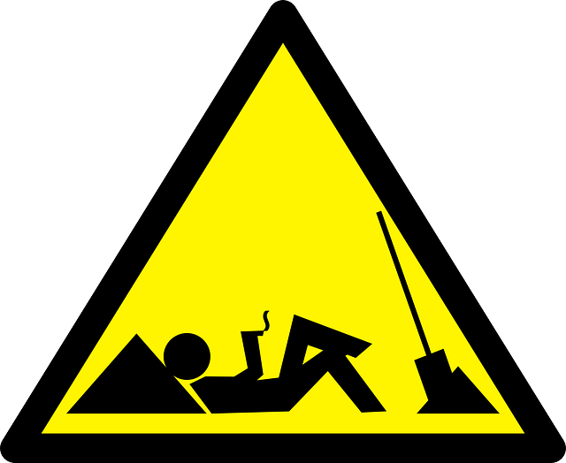

Scala- one step ahead
=====================

:author: Vassil Dichev
:date: |date|

.. |date| date:: %d.%m.%Y

.. footer:: jPrime

.. 

  .. header::

    .. image:: images/jprime-small.png
        :class: scale
        :height: 50
        :width: 150

Who is this guy?
----------------

* J2EE / Spring

* Python / Ruby

* Open-source Scala projects (Apache ESME, Lift)

* Work

  * RememberTheMilk

  * Sentiment

Goals
-----

.. sidebar:: \

  .. image:: images/Construction1.jpg
      :class: scale
      :width: 360
      :height: 480
      :align: center

* Try Scala

  * It's never been easier for a Java developer to learn Scala

* Learn about Java

  * Comparing with Scala

What is Scala
-------------

.. class:: incremental

* Object-oriented

* Functional

* Static typing

* JVM

* REPL (Read-Eval-Print Loop)

  * www.simplyscala.com

Who's using Scala
-----------------

.. class:: borderless

.. list-table::

  * 

    * LinkedIn

    * Twitter

  * 

    * Foursquare

    * The Guardian

  * 

    * Coursera

    * Klout

  * 

    * Quora

    * Walmart

  * 

    * eBay

    * Netflix

  * 

    * HBO Now

    * TomTom

  * 

    * RememberTheMilk

    * 

Why learn Scala?
----------------

.. class:: incremental

* Expressive

* Fun

* Productive

* Educational

* Influential

History
-------

.. sidebar:: \

  .. image:: images/martin_odersky.jpg
      :class: scale
      :height: 256
      :width: 166
      :align: center

.. class:: incremental

* 1997- Martin Odersky & Co. create Pizza

* 2002- Pizza team create GJ (Generic Java)

* 2003- Scala created

* 2004- GJ becomes Java 5

* 2011- Founded Typesafe with advisors James Gosling, Doug Lea, Rod Johnson

Java 8 Survey
-------------

.. image:: images/survey3.png
    :class: scale
    :width: 800
    :height: 400

Java 8 Features
---------------

* Lambda expressions

* Type inference

* Method references

* Default methods

* Streams

* Parallelism (CompletableFuture)

* Optional

.. Java: Lambda expressions

.. 

.. Parameters

.. arrow ->

.. Body

Java lambdas- initial syntax
----------------------------

.. code-block:: java

  x => x + 1
  (x) => x + 1
  (int x) => x + 1
  (int x, int y) => x + y
  (x, y) => x + y
  (x,y) => {out.printf("%d + %d = %d%n", x, y, x+y);}
  () => { out.println("I am a Runnable"); }

Scala syntax
------------

.. code-block:: scala

  x => x + 1
  (x) => x + 1
  (x: Int) => x + 1
  (x: Int, y: Int) => x + y
  (x, y) => x + y
  (x, y) => { printf("%d + %d = %d%n", x, y, x+y); }
  () => { println("I am a function"); }

Spot the differences
--------------------

.. class:: borderless

.. list-table::

  * 

    * 

      .. code-block:: java

        x => x + 1
        (x) => x + 1
        (int x) => x + 1
        (int x, int y) => x+y
        (x, y) => x + y

    * 

      .. code-block:: scala

        x => x + 1
        (x) => x + 1
        (x: Int) => x + 1
        (x: Int, y: Int) => x+y
        (x, y) => x + y

On reusing syntax
-----------------
      So, we felt that it was better to choose something that has already been shown to work well in the two languages that are most like Java -- C# and Scala -- rather than to invent something new.
    
      -- Brian Goetz
    

Scala: Anonymous functions
--------------------------

.. sidebar:: \

  .. image:: images/Anonymous.png
      :class: scale
      :height: 256
      :width: 185
      :align: center

* Java

  .. code-block:: java

    (int x, int y) ->
      { return x + y; };
    (int x, int y) ->
      { x + y; };
    (x, y) -> x + y;
    x -> 2 * x;
    () -> out.println("hey")

* Scala

  .. code-block:: scala

    (x: Int, y: Int) => { x + y }
    { _: Int + _: Int}

Type
----

.. sidebar:: \

  .. image:: images/typewriter.jpg
      :class: scale
      :height: 213
      :width: 320
      :align: center

* Java

  .. code-block:: java

    Runnable r =
      () -> out.println("Hey!");
    Callable<Void> c =
      () -> out.println("Hey!");

* Scala

  .. code-block:: scala

    val c: () => Unit = () => println("Hey!")
    new Function0[Unit] {
      def apply(): Unit = println("Hey")
    }

Partial Functions
-----------------

.. code-block:: scala

  val root: PartialFunction[Double,Double] = {
    case d if (d >= 0) => math.sqrt(d)
  }
  List(1, 2, 3).collect { case 2 => "two" }
  root.isDefinedAt(-2)

Java Employee
-------------

.. code-block:: java

  class Person {
      private String name;
      private int age;
      public Person(String name, int age) {
          this.name = name;
          this.age = age;
      }
      public void setName(String name) {
          this.name = name;
      }
      public String getName() { return name; }
      public void setAge(int age) {
          this.age = age;
      }
      public int getAge() { return age; }
  }

SuperScalaBean
--------------

.. code-block:: scala

  case class Person(name: String, age: Int)

Variable binding
----------------

* Java

  .. code-block:: java

    int sum = 0;
    employees.stream().
              forEach(e -> sum += e.getSalary());
    // COMPILER SAYS NO!

* Scala

  .. code-block:: scala

    val someNumbers = List(-11,-10,-5,0,5,10)
    var sum = 0
    someNumbers.foreach(sum +=  _)

Method references in Java
-------------------------

.. code-block:: java

  // Static
  (x, y) -> Integer.sum(x, y)
  Integer::sum
  // Instance
  (str, i) -> str.substring(i);
  String::substring
  // Instance of specific object
  DateFormat format =
    new DateFormat.getDateInstance();
  (str) -> format.parse(str);
  format::parse

Method references in Scala
--------------------------

.. code-block:: scala

  List(1, 2, 3).reduceLeft(Integer.sum)
  List("May 26, 2015",
       "May 27, 2014").map(format.parse)

Type inference
--------------

* Java- generics/lambdas

  .. code-block:: java

    Map<String, List<String>> myMap =
      new HashMap<>();
    IntBinaryOperator bi = (x, y) -> { x + y; }

* Scala- method-local inference

  .. code-block:: scala

    val s = "it's a string"
    val i = if (predicate) 0 else 1

Java: Default methods
---------------------

* Java

  .. code-block:: java

    interface Collection {
     default void sort(Comparator<? super E> c){
      Collections.sort(this, c);
     }
    }

* Scala

  .. code-block:: scala

    trait MyTrait {
      val myInt = 2 // can have values
      private def myMethod(s: String) =
        s * myInt // and private methods
    }

Default methods resolution
--------------------------

.. sidebar:: \

  .. image:: images/Diamond_inheritance.png
      :class: scale
      :height: 300
      :width: 200
      :align: center

* Classes always win

* More specific interface wins

* Disambiguate

  .. code-block:: java

    class implements B, A {
      void hello() {
        B.super.hello();
      }
    }

Scala multiple inheritance
--------------------------

.. code-block:: scala

  trait ObjectOriented {
    override def toString =
      "object-oriented " + super.toString }
  trait Functional {
    override def toString =
      "functional " + super.toString }
  class ProgrammingLanguage {
    override def toString = "language" }
  var scala = new ProgrammingLanguage
    with Functional with ObjectOriented
  // object-oriented functional language
  scala = new ProgrammingLanguage
    with ObjectOriented with Functional
  // functional object-oriented language

Java: Streams
-------------

.. sidebar:: \

  .. image:: images/stream6.jpg
      :class: scale
      :width: 400
      :height: 300

* Lazy

  * Intermediate operations

  * Terminal- enforce strictness

* Traversible only once

* Short-circuiting

Java streams in action
----------------------

.. code-block:: java

  employees.stream().
            filter(e -> e.getAge() > 30).
            map(Employee::getSalary).
            reduce(Integer::sum)

Scala: Collections
------------------

.. sidebar:: \

  .. image:: images/police.png
      :class: scale
      :height: 294
      :width: 320
      :align: center

* Strict

  * Mutable

  * Immutable

* Non-strict

  * Iterator- single traversal

  * View- multiple traversal

  * Stream (memoizing)

Scala strict vs non-strict
--------------------------

.. code-block:: scala

  employees.         filter(_.getAge > 30).
    map(_.getSalary).      sum
  employees.iterator.filter(_.getAge > 30).
    map(_.getSalary).      sum.toList
  employees.    view.filter(_.getAge > 30).
    map(_.getSalary).force.sum

Streams
-------

.. code-block:: scala

  lazy val fib: Stream[Long] =
    Stream.cons(0, Stream.cons(1, 
      fib.zip(fib.tail).map(pair =>
        pair._1 + pair._2)))

Parallel streams
----------------

* Java

  .. code-block:: java

    employees.parallelStream().
              filter(e -> e.getAge() > 30).
              map(Employee::getSalary).
              reduce(Integer::sum)

* Scala

  .. code-block:: scala

    employees.par.filter(_.getAge > 30).
      map(_.getSalary).sum

Futures
-------

.. -sidebar:: \

  .. image:: images/future.jpg
      :class: scale
      :height: 309
      :width: 388
      :align: center

.. class:: borderless

.. list-table::

  * 

    * **CompletableFuture**

    * **Scala Future**

  * 

    * complete

    * successful

  * 

    * completeExceptionally

    * failed

  * 

    * thenApply

    * map

  * 

    * exceptionally

    * recover

  * 

    * handle

    * transform

  * 

    * thenCompose

    * flatMap

  * 

    * thenCombine

    * reduce

  * 

    * acceptEither

    * firstCompletedOf

  * 

    * allOf

    * sequence

  * 

    * anyOf

    * firstCompletedOf

Optional vs. Option
-------------------

.. http://www.nurkiewicz.com/2013/08/optional-in-java-8-cheat-sheet.html

* Java Optional

  * ifPresent

  * filter

  * map

  * orElse/orElseGet

  * flatMap

* Scala Option

  * Can act as collection

    * forall

    * exists

Java has it, why Scala?
-----------------------
      People often ask me if these features coming to Java will slow the adoption of Scala. Quite the opposite! Instead, I feel the acceptance of these features by the Java Community Process validates our innovation in language design on the JVM. As developers come to understand what these features are and how they work, they will also develop a better appreciation of the more extensive support of functional programming that Scala provides.
    
      -- Martin Odersky

.. http://www.javaworld.com/article/2604122/scripting-jvm-languages/scala-founder-language-due-for-fundamental-rethink.html

.. http://www.infoworld.com/article/2609013/java/scala-founder--language-due-for--fundamental-rethink-.html

.. http://readwrite.com/2014/02/20/java-8-scala-competitors-bffs-martin-odersky

Java vs. Scala?
---------------
      its OK to not turn Java into Scala.  Different languages, different philosophies, so its OK if they draw the line in different places
    
      Java isn't Scala.  What works in Scala libraries may well not work in Java libraries, because the language is different.  So the "right" answer in one language is not necessarily the right answer in another.
    
      Of course, an idea that "fits" in Scala or .NET may or may not fit in Java, or may require adaptation to fit in Java.
    
      -- Brian Goetz
    

Language
--------

.. sidebar:: \

  .. image:: images/Ni_shagu_nazad.jpg
      :class: scale
      :height: 291
      :width: 400
      :align: center

* Syntax

* Community

* Idioms

Did Scala invent all this?
--------------------------

* ML

  * typed functions

  * Option type

  * pattern matching

* Ruby

  * Mixins

  * Everything's an object

* Erlang

  * Actor libraries

* Guava

Language trends
---------------

.. sidebar:: \

  * 
      RT @liammclennan: “functional programming won. Regretably no one noticed.” #ylj15 < that's cos there were no side effects
    

* New generation

  * Rust

  * Swift

* Functional programming

  * Erlang

  * Haskell

  * Clojure

  * C#/F#

* Types are important

  * JavaScript -> TypeScript

  * PHP -> Hack

  * Clojure -> clojure.typed

  * Erlang -> dialyzer

Thank you!
----------
      Questions?
    

.. Car analogy

.. Audi vs. VW vs. Skoda/Seat

.. GM

  .. LDC

  .. LWD

  .. LDD

.. Drawbacks

.. Compiler is slow

.. Backward compatibility

.. Scala criticisms

.. Slow

  .. Detractors to OOP/Java?

.. Too many options

  .. 1984's Newspeak

  .. Trying to make everyone equally productive