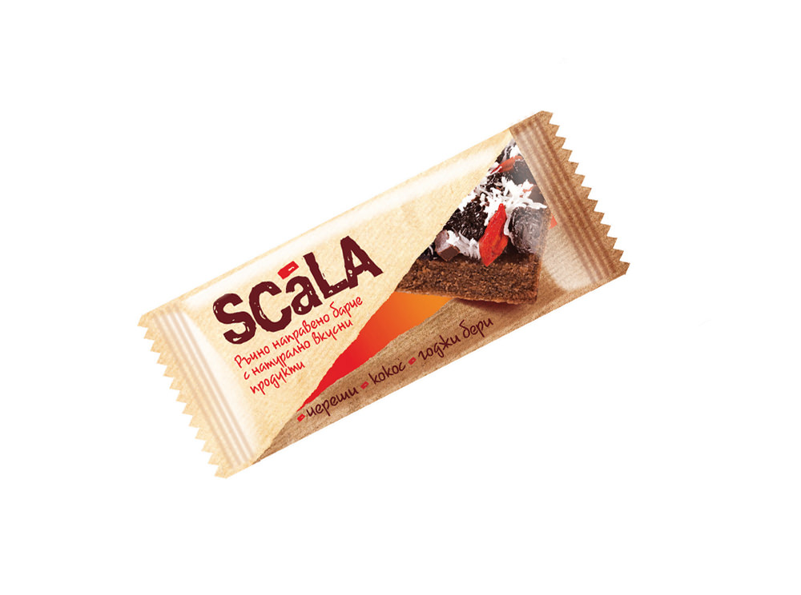

Scala- functional programming
=============================

:author: Vassil Dichev
:date: |date|

From OOP to FP
--------------
      Object-oriented programming makes code understandable by encapsulating moving parts. Functional programming makes code understandable by minimizing moving parts.
    
      -- Michael Feathers
    

Functions
---------

.. sidebar:: \

  .. image:: images/function.png
      :class: scale
      :width: 375
      :height: 375
      :align: center

* Math: mapping inputs to outputs

* Programming: decompose and reuse

Functional programming
----------------------

* Referential transparency

* Functions as first-class

Life without mutation
---------------------

* Recursion

* Persistent data structures

* Local mutation

Recursion
---------

.. image:: images/stack.jpg
    :class: scale
    :width: 687
    :height: 526
    :align: center

Immutability
------------

Classes should be immutable unless there's a very good reason to make them mutable

-- Joshua Bloch, Effective Java

Immutable objects are simple. Immutable objects are also safer. Immutable objects are always threads-safe.

-- Brian Goetz, Java Concurrency in Practice

Persistent data structures
--------------------------

.. image:: images/list.jpg
    :class: scale
    :width: 795
    :height: 570
    :align: center

case classes
------------

* getters

* setters

* toString

* equals

* hashCode

pattern matching
----------------

.. class:: incremental

* wildcards

* constants

* variable

* constructor

* sequence

* tuple

* variable binding

* guards

pattern matching usage
----------------------

* match

* variable assignment

* for expressions

* try / catch

Functions
---------

* Local functions

* Function literals

* Partially applied functions

* Partial functions

Higher-order functions
----------------------

Combinators are arguably the most reusable constructs we have in programming

-- Dean Wampler

* filter

* map

* foldLeft

filter
------

.. image:: images/filter.png
    :class: scale
    :width: 640
    :height: 310

map
---

.. image:: images/map.png
    :class: scale
    :width: 640
    :height: 305

reduce
------

.. image:: images/reduce.png
    :class: scale
    :width: 640
    :height: 320

Sugar for syntax
----------------

Additional resources
--------------------

* `Ammonite shell <https://lihaoyi.github.io/Ammonite>`_

* `Scala IDE <http://scala-ide.org/download/sdk.html>`_

* `Scala Fiddle <http://www.scala-js-fiddle.com/>`_

* `API Docs <http://www.scala-lang.org/api/current/>`_

Homework
--------

* Implement map and filter in terms of foldLeft

.. |date| date:: %d.%m.%Y