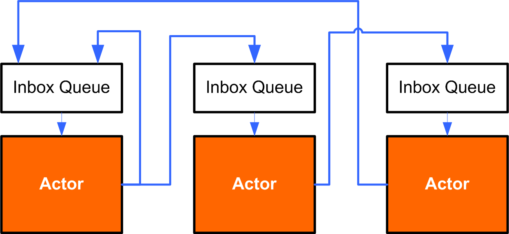

Scala for Java developers
=========================

:author: Vassil Dichev
:date: |date|

.. header::

  .. image:: images/java2days.png
    :class: scale
    :height: 73
    :width: 259

.. footer:: 2010 Java2Days Conference | 7-8 October, Sofia, Bulgaria | www.java2days.com

.. |date| date:: %d.%m.%Y

Who am I
--------

* J2EE/AOP

* Ruby/Python

* Spring, XSL

* Apache ESME and Lift committer

Quotes
------

.. 

  If I were to pick a language to use today other than Java, it would be Scala
  
  -- James Gosling

.. 

  [...] if someone had shown me the Programming in Scala book [...] I'd probably have never created Groovy.
  
  -- James Strachan

.. 

  If you need to use Java, you should be using Scala.
  
  -- Gilad Bracha

.. Before James Gosling quit Oracle

How did we get here?
--------------------

.. class:: incremental

* 1995- Java 1.0 released

* 2006- First closure proposals

* 2009- Mark Reinhold proposes simple closures

* January 2010- Oracle buy Sun

* Now- closures delayed for JDK8 (2012)

  .. Mandatory Perl 6 joke

Meanwhile
---------

.. class:: incremental

* 1997- Martin Odersky & Co. create Pizza

  .. Generics

  .. Function pointers

  .. Case classes and pattern matching

* 2002- Pizza team create GJ (Generic Java)

* 2003- Scala created

* 2004- GJ becomes Java 5

* 2010- Scala 2.8 released

.. Next Java

Why wait?
---------

.. sidebar:: \ 

  .. image:: images/martin_odersky.jpg
    :class: scale
    :width: 166
    :height: 256
    :align: center

.. en.wikipedia.org > Wiki > File:Mark Odersky photo by Linda Poeng

* Object-oriented

* Functional

* Statically typed

* Local type inference

* Compatible with Java

* REPL

  .. lazy

Java2Scala
----------

.. code-block:: scala

  object HelloWorld {
    def main(args: Array[String]) {
      val audience = "Java2Days attendees"
      println("Hello, " + audience + "!")
    }
  }

.. class:: borderless center

.. list-table::

  * 

    * **public**

    * *by default*

  * 

    * **static**

    * singleton (**object**)

  * 

    * *method*

    * **def**

  * 

    * **final**

    * **val**

  * 

    * *variable*

    * **var**

  * 

    * **return**

    * *optional*

JavaBean
--------

.. code-block:: java

  class Person {
      private String name;
      private int age;
      public Person(String name, int age) {
          this.name = name;
          this.age = age;
      }
      public void setName(String name) {
          this.name = name;
      }
      public String getName() { return name; }
      public void setAge(int age) {
          this.age = age;
      }
      public int getAge() { return age; }
  }

"ScalaBean"
-----------

.. image:: images/Coffee_bean.jpg
  :class: scale
  :width: 432
  :height: 284
  :align: center

.. commons.wikimedia.org > Wiki > File:Coffee bean

.. code-block:: scala

  class Person(var name: String, var age: Int)

"SuperScalaBean"
----------------

.. image:: images/Coffee_bean.jpg
  :class: scale
  :width: 432
  :height: 284
  :align: center

.. commons.wikimedia.org > Wiki > File:Coffee bean

.. code-block:: scala

  case class Person(name: String, age: Int)

* equals

* toString

* hashCode

Traits
------

.. en.wikipedia.org > Wiki > File:Diamond inheritance

.. sidebar:: \ 

  .. image:: images/Diamond_inheritance.png
    :class: scale
    :height: 300
    :width: 200
    :align: center

* Interfaces

* ...with implementation

* can compose at instance creation

* stacked- no *diamond problem*

Multiple inheritance
--------------------

.. code-block:: scala

  trait ObjectOriented {
    override def toString =
      "object-oriented " + super.toString }
  trait Functional {
    override def toString =
      "functional " + super.toString }
  class ProgrammingLanguage {
    override def toString = "language" }
  var scala = new ProgrammingLanguage
    with Functional with ObjectOriented
  // object-oriented functional language
  scala = new ProgrammingLanguage
    with ObjectOriented with Functional
  // functional object-oriented language

Immutable collections
---------------------

.. code-block:: scala

  val list = List(1, 3)
  val digitNames = Map(2 -> "two", 4 -> "four")
  
  list(1)
  digitNames(2)
  
  list.apply(1)
  digitNames.apply(2)

* object + apply method = function

Pattern matching
----------------

.. code-block:: scala

  myVar match {
    case s: String => "string: " + s
    case List(1, _*) => "list starting with 1"
    case Person("Martin Odersky", 53) => "Scala's father"
    case _ => 
  }
  
  val digitNames: Int => String = {
    case 2 => "two"
    case 4 => "four"
  }

Scala = Functional
------------------

.. code-block:: scala

  1.to(5)
  // Range(1, 2, 3, 4, 5)
  1.to(5).filter{ i => i % 2 == 0 }
  // Vector(2, 4)
  1.to(5).filter{ _ % 2 == 0 }.map{digitNames}
  // Vector(two, four)

* everything's an object

* higher-order functions

Applications
------------

* Web frameworks (Lift)

  * Comet for real-time interaction

  .. XML processing for view rendering

* Concurrency

  * Akka

* DSLs for BDD

  * Specs

  * ScalaTest

* Parsers

  * Lightweight markup (Knockoff)

The actor model
---------------

.. Image from: Stephan Schmidt's blog, with his permission: http://codemonkeyism.com/wp-content/uploads/2008/12/concurrency_actor.png

* Asynchronous

* Private state

* Immutable messages

* Internal message queue

Actor example
-------------

.. code-block:: scala

  val myActor = actor {
    loop {
      react {
        case s: String => println("Got: " + s)
        case 42 => println("""the answer to life
  the universe and everything""")
        case _ => println("Unknown type")
      }
    }
  }
  myActor ! "test"
  myActor ! 42
  myActor ! 2.5

.. Not all concurrency use cases are appropriate for actors

DSLs for BDD
------------

.. class:: center

.. code-block:: scala

  reverse("") must be empty
  1 must beOneOf(1, 2, 3)
  list must have size(3)

.. class:: center

.. code-block:: scala

  (reverse("").must(be)).empty
  (1.must(beOneOf(1, 2, 3))
  (list.must(have)).size(3)

Parsers
-------

.. code-block:: scala

  class JSON extends JavaTokenParsers {
    def value = obj | arr |
                 stringLiteral |
                 floatingPointNumber |
                 "null" | "true" | "false"
    def obj = "{"~repsep(member, ",")~"}"
    def arr = "["~repsep(value, ",")~"]"
    def member = stringLiteral~":"~value
  }

What now?
---------

.. sidebar:: \ 

  .. image:: images/editor.png
    :class: scale
    :align: center
    :width: 256
    :height: 192

* Should I try Scala?

* Should I use Scala?

  .. Not if you're paid for LOC!

  * integration effort

  * maintenance terms

  * tools and IDEs

  * colleagues

  * bosses

Learning Scala
--------------

.. class:: borderless

.. list-table::

  * 

    * 

      .. image:: images/BeginningScala.gif
        :class: scale
        :align: center
        :width: 86
        :height: 114

    * Beginning Scala

    * 

      * David Pollak

  * 

    * 

      .. image:: images/ProgrammingInScala.gif
        :class: scale
        :align: center
        :width: 91
        :height: 118

    * Programming in Scala

    * 

      * Martin Odersky

      * Bill Venners

      * Lex Spoon

  * 

    * 

      .. image:: images/ProgrammingScala.gif
        :class: scale
        :align: center
        :width: 90
        :height: 117

    * Programming Scala

    * 

      * Alex Payne

      * Dean Wampler

Introducing Scala
-----------------

* Testing

* Build system

* Infrastructure

* Back office project

The end
-------

.. class:: huge center incremental

  ???
  
  !!!
  
  ...